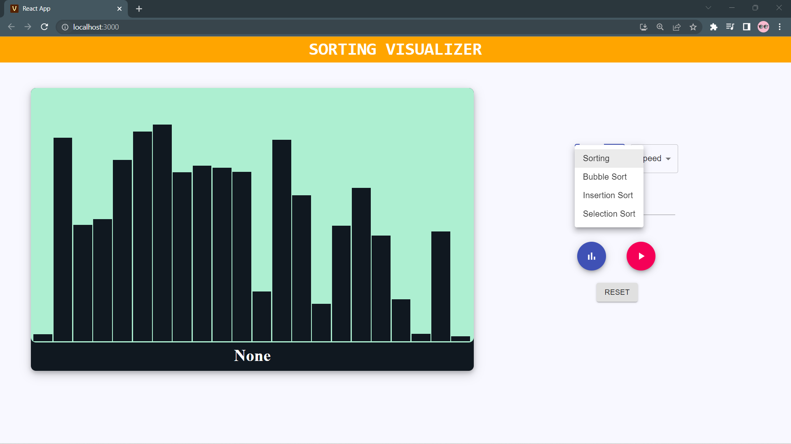
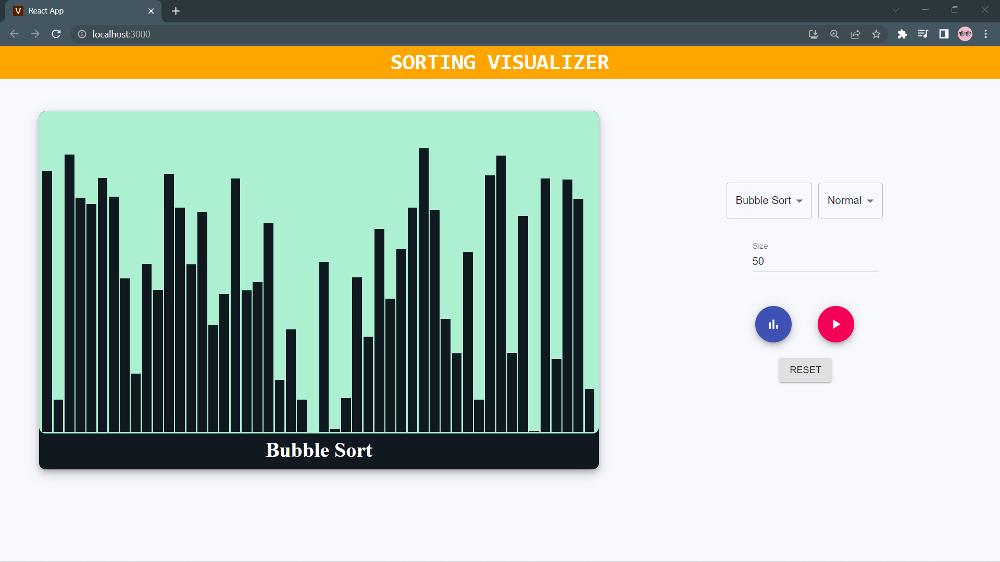
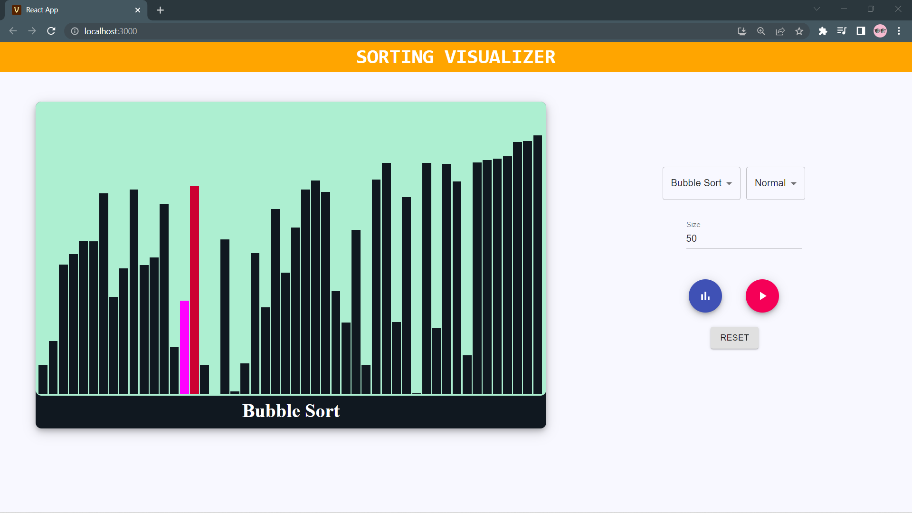
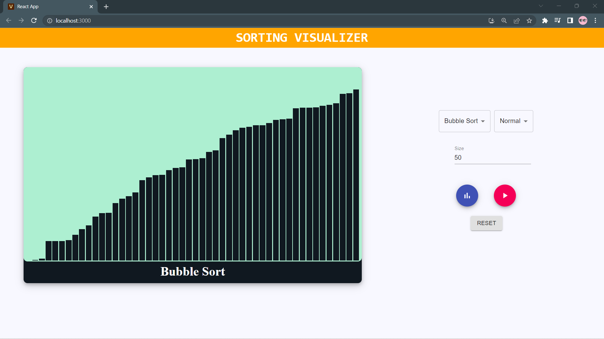

<h1 align="center">
Sorting Visualizer
</h1>
<h6 align="center">A React based web application.</h6>

> Sorting Visualizer is a web application which is developed and deployed on react. It is used to visualize how the sorting works as it depicts the same in various manner.
> It provide the following operation to be performed : <ul><li>Select the type of sorting(Bubble , Insertion, Selection)</li> <li>Select the speed of visualization (fast, slow, normal)</li> <li>select the size of array to sort (no of elements)</li> <li>Random elements generator</li></ul>
 

# Project Images

> More Images are in Project images folder.

